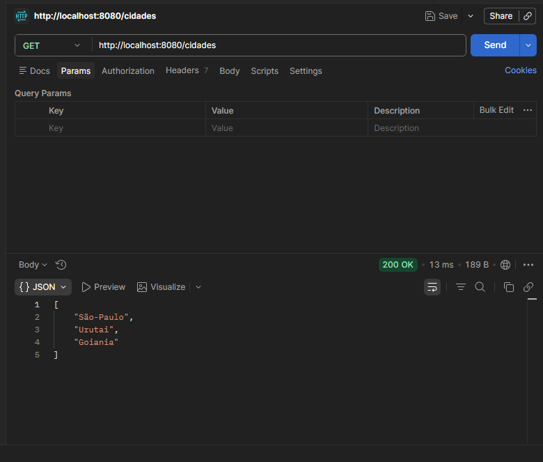
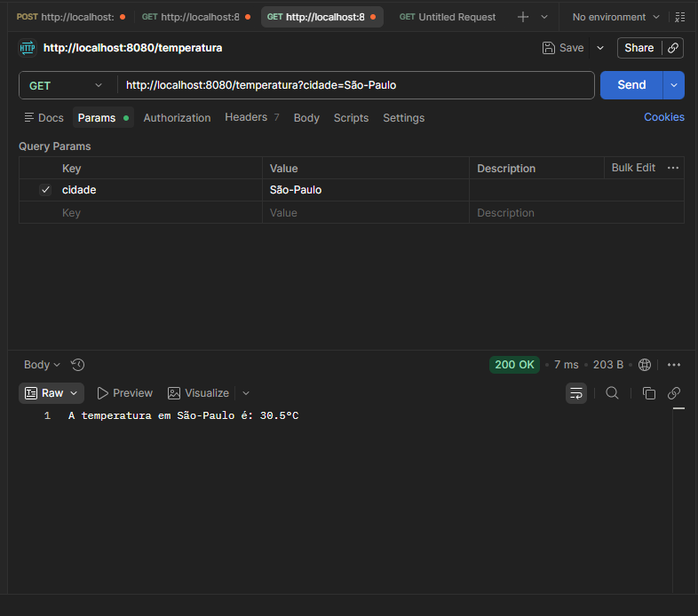
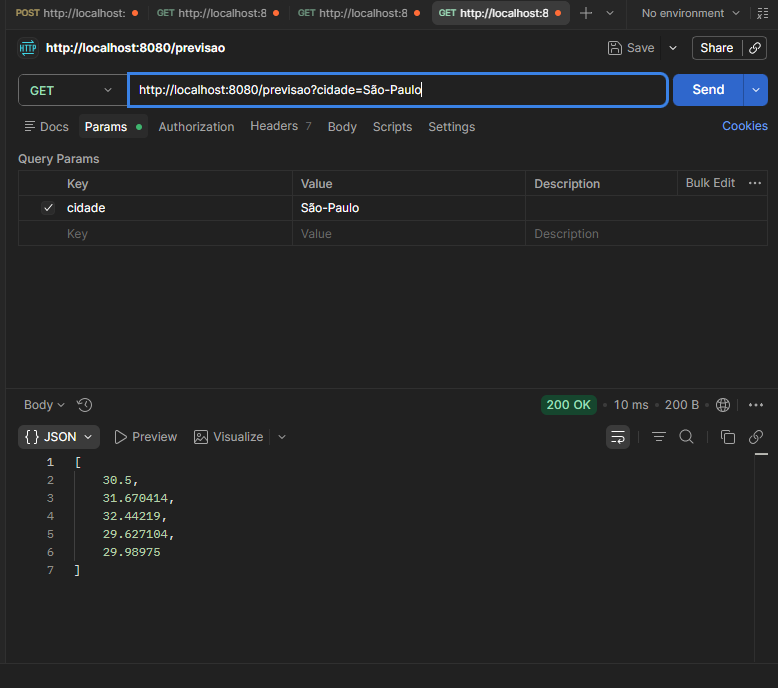
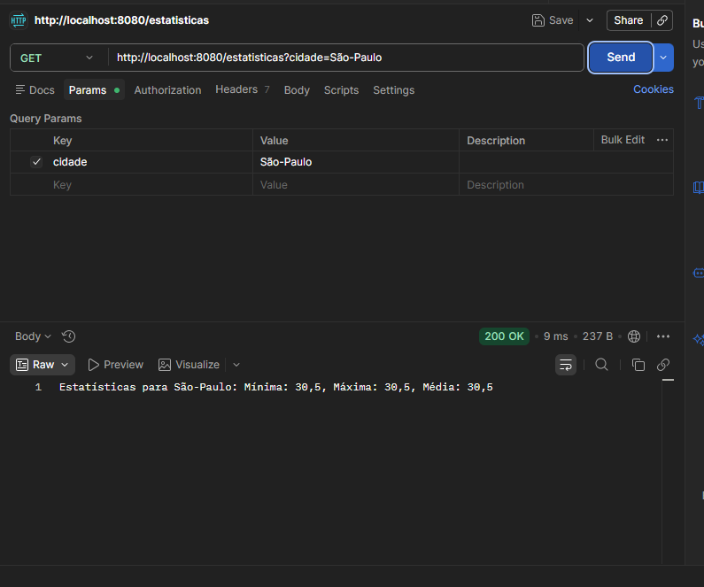
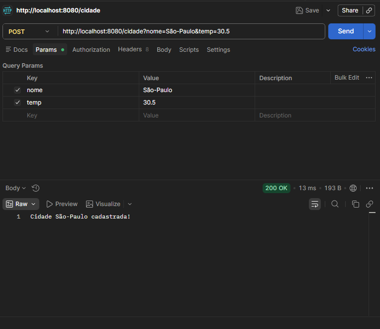

# 🌦️ Sistema Meteorológico Distribuído (gRPC + Spring Boot)

Este projeto demonstra a implementação de um sistema distribuído para fornecimento de dados climáticos. A arquitetura utiliza uma **API REST** como porta de entrada (Gateway) que se comunica com um **Servidor gRPC** para processamento e recuperação de informações meteorológicas.

## 🚀 Como Rodar o Projeto

### Pré-requisitos
*   **Java 21** (ou versão superior)
*   **Maven 3.8+**
*   Ferramenta para testes de API (Postman, Insomnia ou cURL)

### Passo a Passo
1.  **Clonar o repositório:**
    ```bash
    git clone [https://github.com/seu-usuario/clima-grpc.git](https://github.com/seu-usuario/clima-grpc.git)
    cd clima-grpc
    ```

2.  **Gerar as classes gRPC (Stubs):**
    O gRPC utiliza Protocol Buffers. Para gerar as classes Java a partir do arquivo `.proto`, execute:
    ```bash
    mvn clean compile
    ```
    *Isso criará os arquivos necessários em `target/generated-sources/protobuf/`.*

3.  **Executar a aplicação:**
    ```bash
    mvn spring-boot:run
    ```

4.  **Acessar os serviços:**
    *   **API REST:** `http://localhost:8080`
    *   **Servidor gRPC:** Rodando internamente na porta `9090`

---

## 📄 Detalhamento do Arquivo `.proto`

O arquivo `weather.proto` define o contrato de comunicação entre o cliente e o servidor.

### 1. Definição do Serviço (`service`)
O `service WeatherService` atua como uma interface que expõe os métodos remotos. Cada método é definido como um `rpc`, recebendo uma mensagem de entrada e retornando uma de saída.

### 2. Definição das Mensagens (`message`)
As mensagens são estruturas de dados fortemente tipadas:
*   **Campos Simples:** Como `string nome` ou `float temperatura`.
*   **Campos Repetidos (`repeated`):** Equivalem a listas ou arrays (ex: `repeated float temperaturas`).
*   **Tipos Vazios:** O `message Empty {}` é usado para chamadas que não requerem parâmetros de entrada.

### 3. RPCs Implementados
*   **`ObterTemperaturaAtual`**: Recebe o nome da cidade e retorna a última temperatura registrada.
*   **`PrevisaoCincoDias`**: Retorna uma lista de 5 valores simulados para os próximos dias.
*   **`ListarCidades`**: Retorna os nomes de todas as cidades presentes no mapa em memória.
*   **`CadastrarCidade`**: Permite adicionar uma nova cidade e uma temperatura inicial.
*   **`EstatisticasClimaticas`**: Processa a lista de temperaturas da cidade para devolver a média, o valor mínimo e o máximo.

### 4. Geração de Código (Stubs)
A partir do `.proto`, o compilador `protoc` gera:
*   **Modelos:** Classes Java para cada `message`.
*   **Stub do Servidor:** Uma classe base (`WeatherServiceImplBase`) que implementamos no servidor.
*   **Stub do Cliente:** Uma classe que o cliente usa para chamar os métodos remotos como se fossem locais.

---

## 🔄 Fluxo Completo: Do HTTP ao gRPC

O fluxo de processamento segue estas etapas:

1.  **Entrada HTTP:** O usuário faz uma requisição REST (ex: `GET /temperatura?cidade=Urutai`).
2.  **Controller REST:** O Spring Boot intercepta a requisição no `WeatherController`.
3.  **Conversão e Chamada:** O Controller cria uma mensagem gRPC usando o padrão *Builder* e a envia através do `weatherStub`.
4.  **Comunicação gRPC:** Os dados são serializados em formato binário (Protocol Buffers) e enviados via HTTP/2 para o servidor.
5.  **Processamento:** O servidor gRPC recebe a chamada, executa a lógica de negócio no `WeatherServiceImpl` e devolve a resposta.
6.  **Resposta Final:** O cliente REST recebe o objeto de resposta, e o Spring Boot o converte automaticamente para **JSON** para ser exibido no Postman.

---

## 🛠️ Tecnologias Utilizadas
*   **Spring Boot**: Framework para a aplicação.
*   **gRPC**: Framework de RPC de alta performance.
*   **Protocol Buffers**: Linguagem de interface e serialização.
*   **Maven**: Automação de build e dependências.

---

## 📸 Demonstração (Testes no Postman)

Abaixo estão as evidências do funcionamento dos endpoints REST integrados ao servidor gRPC:

### 📍 Listar Cidades
Retorna todas as cidades disponíveis no sistema.


### 🌡️ Obter Temperatura Atual
Busca a temperatura em tempo real de uma cidade específica.


### 📅 Previsão de 5 Dias
Retorna uma lista de temperaturas simuladas para os próximos dias.


### 📊 Estatísticas Climáticas
Exibe a média, mínima e máxima registradas para a cidade.


### 🆕 Cadastrar Nova Cidade
Adiciona uma nova localidade ao banco de dados em memória.

